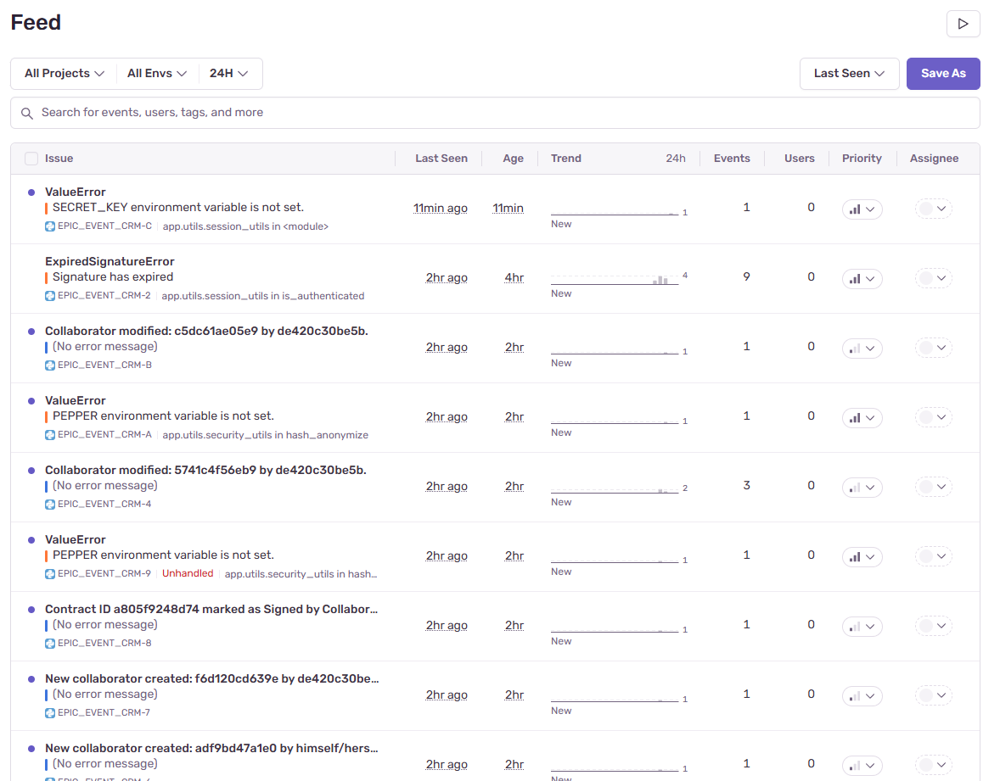

# Secure Back-End Architecture for CRM Management


## Description

This project is a secure, modular command-line application.  
It allows a company to manage its collaborators, customers, contracts, and events while enforcing strict permissions based on user roles.

The application uses a PostgreSQL database, SQLAlchemy for ORM, and JWT for user authentication.  
It follows best practices in code architecture and access control, providing a clear separation of concerns and reusable utilities.

## Features

Liste des fonctionnalités principales du projet.

## Installation

1. Clone the repository:

   ```bash
   git clone https://github.com/MagNott/P12_Developpez_architecture_back_end_securisee

2. Create a virtual environment and activate it:

   >for Linux/macOS:
   >```bash
   >python3 -m venv venv
   >source venv/bin/activate
   >```

   >for Windows:
   >```shell
   >python -m venv venv
   >.\venv\Scripts\activate
   >```

3. Install dependencies:

   ```bash
   pip install -r requirements.txt
   ```

4. Set up environment variables

   To run this project securely and ensure proper behavior in different environments, you need to configure the following environment variables:

   In your terminal session before running the app

   >For Linux/macOS:
   >```bash
   >export SENTRY_DSN="votre_dsn_ici"
   >export SECRET_KEY="votre_cle_secrete_ici"
   >export PEPPER="votre_pepper_ici"
   >
   >```

   >For Windows (Command Prompt):
   >```shell
   >$env:SENTRY_DSN="votre_dsn_ici"
   >$env:SECRET_KEY="votre_cle_secrete_ici"
   >$env:PEPPER="votre_pepper_ici"
   >```

   ### ⚠️ The real environmental variables to use are provided to the mentor evaluator in the deliverable. ⚠️


## Usage

To start the application, run the following command:

```bash
python main.py
```

Once launched, you will see a menu with the following options:

- Sign in: Log in with your credentials to access features based on your department.
- Sign up: Register a new collaborator account (requires department ID).
- Log out: Exit the current session securely.

After signing in, the app will display a department-specific menu:

Management:
- Create and modify contracts
- Manage collaborators (create, update, delete)
- Assign support staff to events

Support:
- View and update your assigned events

Sales:
- Create and modify customers and contracts
- Create an event for a signed customer

You can navigate through the menu using the keyboard, and each command will guide you through the required inputs.


## Authentication and Permissions

This project uses JSON Web Tokens (JWT) to handle authentication and secure access to CLI features.

- When a user logs in, a JWT token is generated and stored locally in .session
- This token contains essential user data (ID, department, expiration) and is signed using a secret key.
- On each action, the token is decoded and verified to ensure the user is authenticated.
- Access to features is controlled through a role-based permission class, which checks the user's authentication status and department.
- All permissions are enforced via a centralized logic layer, ensuring secure, consistent, and maintainable access control.


## Error Monitoring with Sentry

This project integrates Sentry to monitor errors in production, improve  application reliability, and assist with debugging.

### How it works in production

If the SENTRY_DSN environment variable is defined, Sentry is automatically initialized via the official SDK:

```python
dsn_env = os.getenv("SENTRY_DSN")
if not dsn_env:
    raise ValueError("SENTRY_DSN environment variable is not set.")

sentry_sdk.init(
    dsn=dsn_env,
    send_default_pii=True,
    enable_logs=True,
)
```

### This setup ensures:

Automatic reporting :

- All unexpected exceptions 
- Each creation/modification of a collaborator
- The signing of a contract (for the scenario-based option).

An exemple of my sentry dashboard showing captured errors and events:



### Behavior during tests

To prevent any data from being sent to Sentry during tests, the environment variable SENTRY_DSN is overridden with an empty or fake value in conftest.py:

```python
os.environ["SENTRY_DSN"] = "https://fake@sentry.io/123"
```

The conditional initialization ensures Sentry is never activated during test runs.

## Security

- Passwords are hashed and salted using bcrypt before being stored.
- JWT tokens are signed using a secret stored in the environment (SECRET_KEY) , and include an expiration time.
- Expired or missing tokens prevent access to protected commands. JWTs are decoded and validated at every action.
- User data are anonymized in logs to protect privacy with a hash function combined with a `PEPPER` stored in environment variable.
- Injections are prevented by using SQLAlchemy ORM for all database interactions.
- Environment variables are used for all sensitive configuration — no secrets are hardcoded.
- During testing, fake environment variables are injected and Sentry is disabled to ensure no external data leaks.


## Author

This project was developed by Magnott in October 2025 as part of the Python Application Developer program at OpenClassrooms.
